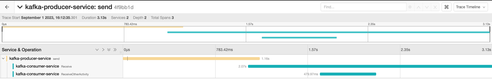

# dotnet-otel-kafka-demo
Simple app to demonstrate how to perform otel tracing in .net across Kafka topics. ~~The example simply sets the otel headers in the the kafka event. The consumer extracts these and continues the trace~~ 


Instead the application now user context Propagators to send the kafka context across the wire. This allows much more flexibilty how we  inject and set contexts and also adheres to otels sdk recommended approach. 


## Prep Demo
The following create the demo setup 
 
### Start  kafka Broker 
```
cd deploy/kafka 
docker compose up -d 
```
### Create topic 
```
 docker compose exec broker \
  kafka-topics --create \
    --topic purchases \
    --bootstrap-server localhost:9092 \
    --replication-factor 1 \
    --partitions 1 
```

### Deploy otel 
taken from here. Commenting out the client and server aspects 
https://github.com/open-telemetry/opentelemetry-collector-contrib/tree/main/examples/demo 
```
cd deploy/otel 
docker compose up -d 
```


### build and run producer
This creates a single message on kafka 
```
cd producer 
dotnet build
dotnet run $msg
```
Kafka connection configuration is confifgured in appsettings.json
 ```
  "KafkaProducerConfig": {
    "BootstrapServers": "localhost:9092",
    "ClientId": "my-producer-id",
    "Acks": "all"
  },
```
### Build and run consumer
Kafka connection configuration is confifgured in appsettings.json 
 ```
cd consumer 
dotnet build
dotnet run 
```

Kafka connection configuration is confifgured in appsettings.json
 ```
  "KafkaConsumerConfig": {
    "BootstrapServers": "localhost:9092",
    "ClientId": "my-consumer-id",
    "Acks": "all",
    "GroupId": "kafka-dotnet-getting-started",
    "AutoOffsetReset": "earliest"
  },
```

### View Results in Jaeger 
The results can be see in the jaeger UI which was started in the OTEL docker compose up. Go to http://127.0.0.1:16686/



## Notes 
* https://learn.microsoft.com/en-us/dotnet/core/diagnostics/distributed-tracing-instrumentation-walkthroughs
* Would be ideal to user "Propagator.Inject(new PropagationContext(contextToInject, Baggage.Current), header, this.InjectHeader);" but for now i could not get the approaches i tried to work
* https://github.com/open-telemetry/opentelemetry-dotnet/blob/main/examples/AspNetCore/Program.cs
* https://github.com/open-telemetry/opentelemetry-dotnet-instrumentation 
* https://github.com/confluentinc/confluent-kafka-dotnet/pull/1838
* https://github.com/open-telemetry/opentelemetry-dotnet/blob/e3df42bfc15dc1d4dff01d655f669f7c27e35312/examples/MicroserviceExample/Utils/Messaging/MessageSender.cs#L78
* https://github.com/open-telemetry/opentelemetry-dotnet/issues/3562#issuecomment-1225938368
* https://github.com/open-telemetry/opentelemetry-dotnet/blob/main/src/OpenTelemetry.Api/Context/Propagation/B3Propagator.cs
* https://www.twilio.com/blog/propagate-opentelemetry-context-via-azure-service-bus-for-async-dotnet-services